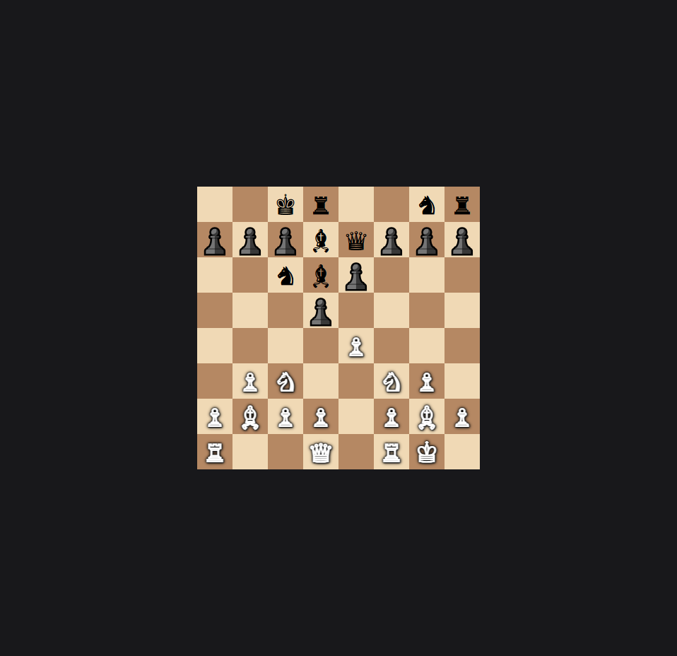
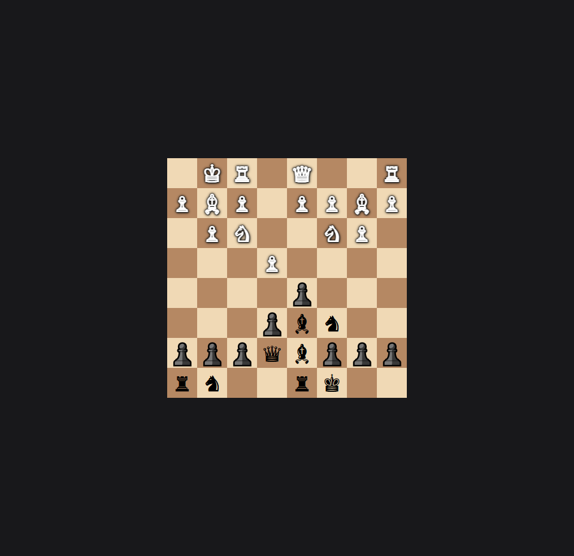
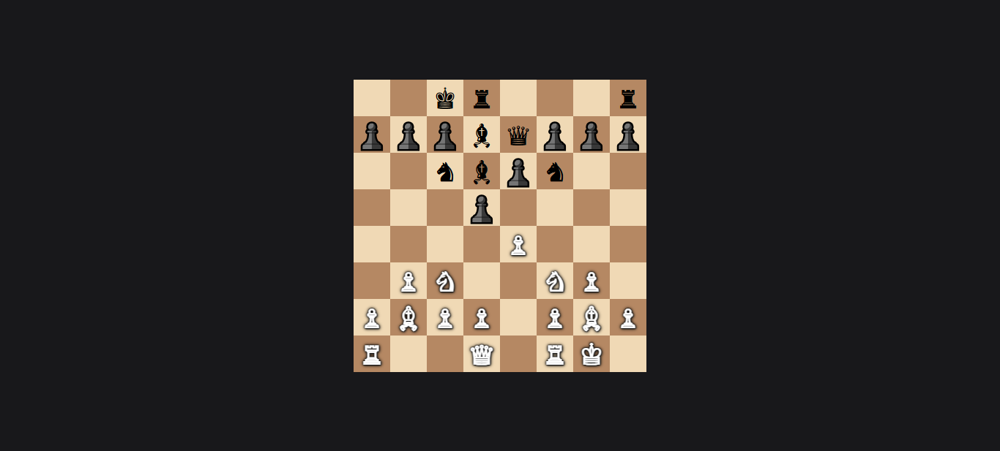

# ♟️ Real-Time Multiplayer Chess Game (MERN Stack)

This is a real-time multiplayer Chess game with spectator mode built using the **MERN stack** (MongoDB, Express.js, React.js, Node.js) and **Socket.IO** for real-time gameplay. It allows:
- 🧑‍🤝‍🧑 **Two players** to connect and play (first = White, second = Black)
- 👁️ **Spectators** to watch the match live
- ♻️ Full restart/reset capability
- 🧠 Valid move logic with turn-based control

---

## 🔗 Live Demo

Coming soon / [Your deployed URL here]

---

## 🖼️ Screenshots

### 🎮 Player 1 (White)


### 🎮 Player 2 (Black)


### 👁️ Spectator View


---

## 🚀 Tech Stack

| Layer     | Tech                     |
|-----------|--------------------------|
| **Frontend** | React.js, chessboard.js |
| **Backend**  | Node.js, Express.js     |
| **Database** | MongoDB (optional for logging games/users) |
| **Realtime** | Socket.IO               |

---

## ⚙️ Features

- ♟️ Chess move validation using [`chess.js`](https://github.com/jhlywa/chess.js)
- 🎯 Two-player real-time gameplay
- 🔄 Game restart and move tracking
- 📡 WebSocket-based communication using Socket.IO
- 👁️ Spectator mode for unlimited viewers
- 🧼 Clean and responsive React interface

---

## 🛠️ Installation & Setup

### ⚙️ Backend

```bash
cd server
npm install
npm run start

🌐 Frontend
bash
Copy
Edit
cd client
npm install
npm start
This runs the React frontend on port 3000.

